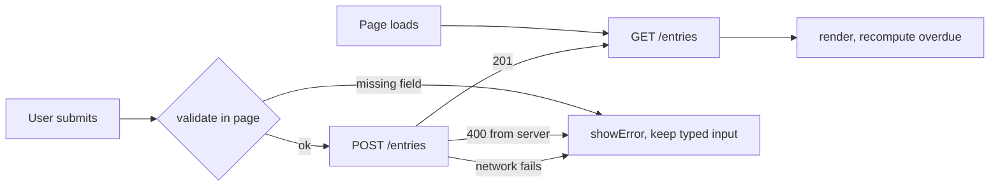

# Coach Contact Log: Data Leaves the Browser


## What

HW3 repository: [ryanlinde-gif/mgt3745-hw3](https://github.com/ryanlinde-gif/mgt3745-hw3)

A high school soccer player records which college coaches she has emailed, at
which school, on what date, and where each one stands, and the log flags anyone
who has gone seven days without a reply. The problem is in
[PROJECT.md](context/PROJECT.md); the version that matters is narrower and comes
from an interview in [USERS.md](context/USERS.md), where she described telling
herself to follow up and then forgetting which coaches she owed, because practice
or school got in the way. That is a memory failure, so the fix is a record. The
specification and the full verification run are in
[FEATURES.md](context/FEATURES.md).

**Where the data lives now:** entries moved out of browser localStorage into a
Cloudflare D1 database reached through a Worker I wrote, because localStorage was
per-device and per-browser, which meant her laptop and her phone were two
different logs and clearing site data destroyed both silently. That decision, the
crossing it creates, and the four things it made worse are in
[ADR-002](context/ARCHITECTURE.md).

## See It Work


This is **E17**: *WHERE an entry has been saved, THE SYSTEM SHALL return it to any
browser that requests it, not only to the browser that saved it.*

The evidence is the empty `localStorage` next to the full list. In HW3 those three
entries *were* the browser storage; clearing it destroyed them. Here the storage is
empty, the page was reloaded from scratch, and the entries came back anyway,
because they were never in the browser to begin with.

The stronger version of the same proof needs no browser at all:

```
$ curl -s https://mgt3745-hw4.ryanlindebusiness.workers.dev/entries
[{"id":1,"coachName":"A. Rivera","school":"Elon University", ...
```



Validation runs twice on purpose. The page checks so the user gets an instant
answer; the Worker checks again because the page can be skipped entirely and
`POST /entries` is reachable from anything.

## How to Run

**Deployed:** <https://mgt3745-hw4.ryanlindebusiness.workers.dev/entries>

That URL returns the stored entries as JSON and needs nothing installed.

**To run the page against it:** serve `index.html` over HTTP from an origin in the
`ALLOWED_ORIGINS` list at the top of `worker.js`, then open it. In a Codespace,
right-click `index.html` and choose **Open with Live Server**. Opening the file
through `file://` will not work; the Worker will refuse the request and the list
will stay empty.

**To deploy your own copy from a fresh Codespace:**

1. Open the repository in a Codespace. The devcontainer installs `xdg-utils` and runs `npm install`.
2. `npx wrangler login --device`
3. `npx wrangler d1 create mgt3745-entries`, then paste the printed `database_id` into `wrangler.toml`
4. `npx wrangler d1 execute mgt3745-entries --remote --file=schema.sql` — the `--remote` matters; without it the table is created locally and the deployed Worker returns 500
5. `npx wrangler deploy`
6. Put the printed URL into `app.js` as `API`, and add the page's origin to `ALLOWED_ORIGINS` in `worker.js`

Full command list and a failure table: [docs/SESSION_B_COMMANDS.md](docs/SESSION_B_COMMANDS.md).

To run the Worker locally instead: `npm run dev` on port 8787 with a local D1 emulator.

## Status

| Feature | EARS statement | Verdict |
|---|---|---|
| Save an entry | E10 — WHEN a valid entry is submitted, THE SYSTEM SHALL save and display it | PASS |
| Reject an empty field, by name | E12 — IF a required field is empty, THEN THE SYSTEM SHALL reject it and name the field | PASS, enforced in the page and again in the Worker |
| 201-character boundary | E12 — the same rule at its limit | PASS. This was **CANNOT TEST** in HW3 and now has evidence on both sides of the boundary |
| Survive a cleared cache | E17 — THE SYSTEM SHALL return entries to any browser | PASS |
| Submitted SQL stored as data | E16 — IF a field contains database syntax, THE SYSTEM SHALL store it as text | PASS. `Robert'); DROP TABLE entries;--` stored as a name; table intact |
| Network unreachable | E18 — IF the server cannot be reached, THE SYSTEM SHALL say so and not throw | PASS |
| Follow-up flag at seven days | E13 — flagged at 8 days, not at 6 | PASS |
| Server returns 500 | — | **CANNOT TEST YET.** I could not make the deployed Worker fail internally without editing it to fail on purpose, which tests a different program |
| Two clients, one table | — | **DEFERRED (ADR-002)**, which names a second writer as a revisit trigger |
| Anyone with the URL can read, write, and delete everything | — | **FAIL, known and recorded.** No authentication. Consequence 2 in ADR-002; ADR-003 is owed before this holds real data |

Full verification table, with steps and observed results: [FEATURES.md](context/FEATURES.md).

## Links

Reading order for a stranger: [PROJECT.md](context/PROJECT.md) →
[USERS.md](context/USERS.md) → [FEATURES.md](context/FEATURES.md) →
[ARCHITECTURE.md](context/ARCHITECTURE.md) → [STANDARDS.md](context/STANDARDS.md) →
[TOOLS.md](context/TOOLS.md) → [STYLE.md](context/STYLE.md) →
[CLAUDE.md](context/CLAUDE.md)

Three files in `/context` remain previews until their modules activate:
[SKILLS.md](context/SKILLS.md), [EVALS.md](context/EVALS.md),
[AGENTS.md](context/AGENTS.md).

## AI Use

**What the agent wrote.** Claude (Opus 5, via Claude Code) adapted the template's
single-column schema into the four-field contact entry, wrote the GET route and
the server-side validation, wired `app.js` from localStorage to `fetch`, added the
DELETE route, and drafted the context documents. **GitHub Copilot wrote the SQL
INSERT** in `worker.js`, which is the one piece I deliberately delegated to it.

**What I checked, and how.** The assignment predicted Copilot would hand me
string-concatenated SQL. It did not: it produced `VALUES (?, ?, ?, ?)` with the
values in a separate `.bind()`, which is correct. My read on why is that the four
queries already in that file used `prepare().bind()`, so the safety came from the
context it was sitting in rather than from the model being reliably careful. I did
not test whether it would answer the same way in an empty file.

**What I could not fully verify, and what I did about it.** I could check the
*shape* of Copilot's insert — question marks in the SQL, values passed separately.
I could not check by reading that the four bound values line up with the four
columns in the right order. `coach_name, school, contact_date, status` against
`body.coachName, body.school, body.contactDate, body.status` — if two of those
were swapped, the code would run, return 201, and store the school in the coach
field permanently. Reading it harder would not have told me.

So I tested it instead: I posted one entry with four deliberately distinct values
(`AAA-COACH`, `BBB-SCHOOL`, `2026-01-02`, `CCC-STATUS`) and read them back. Each
landed in its own field. I then tested the claim `bind()` actually makes, by
saving a coach named `Robert'); DROP TABLE entries;--` and confirming it came back
as a name with the table intact. Both are rows in
[FEATURES.md](context/FEATURES.md).

**The thing I got wrong on my own.** For about twenty minutes the deployed Worker
returned `201 Created` on every POST while storing nothing, because the INSERT was
still a TODO. Nothing errored; the status code lied. I only caught it because I
checked the list after posting instead of trusting the response. That is the same
failure I wrote about in HW3, and it was the status code, not the code, that fooled
me. It and four others are in
[curiosity/FAILURES.md](context/curiosity/FAILURES.md).

**Instruction discovery.** Copilot was run in a Codespace on this repository. I
have not verified which instruction file it discovered, and this repository has no
`.github/copilot-instructions.md` adapter, so I am not claiming discovery evidence.
What I can report is the output: the code it produced satisfies STANDARDS.md rule 8
on `bind()`, and I did not have to correct it.

**Hours spent:** [REPLACE WITH A NUMBER]
